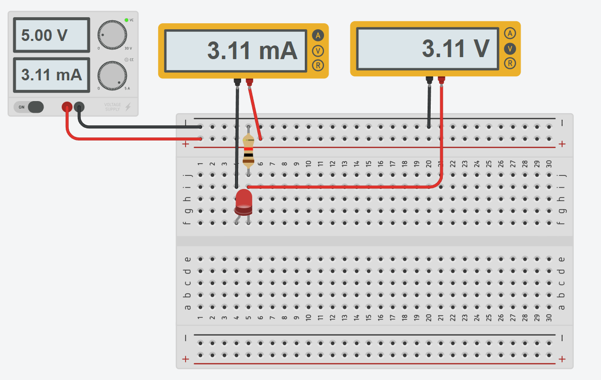
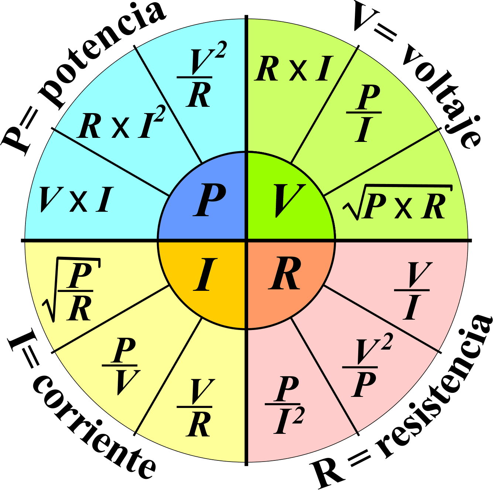

# Guía de Laboratorio 1: Variables Fundamentales Electrónica

## 1. Objetivos

- Medir voltaje, corriente y resistencia en un circuito con LED.
- Verificar experimentalmente la Ley de Ohm.
- Observar cómo varía el brillo del LED con cambios en la corriente.
- Analizar la disipación de potencia en un hilo de nicrom mediante la Ley de Joule.
- Comprender el uso del multímetro y el protoboard en mediciones eléctricas.

## 2. Prelaboratorio

Antes de realizar este laboratorio, el estudiante debe estudiar los siguientes conceptos:

- **Carga eléctrica**: $Q = I \cdot t$
- **Ley de Ohm**: $V = I \cdot R$
- **Ley de Joule**: $P = I^2 \cdot R$
- **Resistencia de un conductor**: $R = \frac{\rho L}{A}$
- **Uso del multímetro** para medir resistencia, voltaje y corriente.
- **Uso del protoboard** para el armado de circuitos eléctricos.

## Problemas

### Problema 1: Resistencia de un filamento

Un filamento de una bombilla tiene una resistencia de $2.2\Omega$ cuando está frío, pero cuando se calienta su resistencia aumenta a $330\Omega$. Si la bombilla está conectada a una batería de $12V$, ¿cuál es la corriente en el filamento en ambos estados? Exprese los resultados en miliamperios (mA).

### Problema 2: Resistencia de un cable largo

Un cable de cobre de $100m$ tiene una resistencia de $8.5m\Omega$ por metro. Si se usa este cable para transmitir una corriente de $15A$, ¿cuál es la caída de tensión total en el cable? Exprese la respuesta en voltios (V) y en milivoltios (mV).

### Problema 3: Energía consumida por un circuito

Un motor eléctrico de $50W$ funciona con una batería de $24V$. ¿Cuál es la corriente que consume el motor? ¿Cuánta energía en joules consume en una hora de funcionamiento? Expresa los resultados en amperios (A), miliamperios (mA) y kilojoules (kJ).

### Problema 4: Potencia en un resistor desconocido

Se tiene un resistor desconocido conectado a una fuente de $15V$. Se mide una corriente de $2mA$. ¿Cuál es el valor de la resistencia? ¿Cuánta potencia disipa el resistor? Expresa los resultados en kiloohmios ($k\Omega$) y microwatts ($\mu W$).

### Entrega
Cada respuesta debe incluir el análisis del problema, las ecuaciones utilizadas y los cálculos detallados con unidades en notación de ingeniería.

## 3. Lista de Materiales

| Cantidad | Material |
|----------|----------|
| 1 | Resistencias de $1k\Omega$ |
| 1 | Resistencia de $470\Omega$ |
| 1 | LEDs de diferentes colores |
| 1 | Protoboard |
| 4 | Cables para protoboard |
| 1 | Hilo de nicrom (30 cm) |
| 1 | Pinzas |

## 4. Procedimiento

### Fundamento Teórico

Un circuito en serie con un LED y una resistencia permite limitar la corriente que pasa a través del LED para evitar daños. La Ley de Ohm se expresa como:

$$V = I \cdot R$$

La tolerancia de la resistencia se calcula comparando el valor medido con el valor nominal usando la ecuación:

$$\text{Tolerancia} = \left( \frac{|R_{medido} - R_{nominal}|}{R_{nominal}} \right) \times 100\%$$

### Procedimiento Experimental
Realizar el montaje del siguiente circuito:

**Medición de la resistencia**
1. Medir el valor real de cada resistencia con el multímetro.
2. Registrar el valor obtenido.

**Medición de voltaje y corriente en el circuito**
1. Conectar la resistencia y el LED en serie sobre la protoboard.
2. Conectar la fuente de alimentación a $5V$.
3. Medir y registrar la caída de voltaje en la resistencia y en el LED.
4. Medir y registrar la corriente en el circuito.
5. Repetir las mediciones aumentando el voltaje de la fuente a $7V$, $9V$ y $12V$.
6. Observar y describir el cambio en el brillo del LED.

## 5. Preguntas para el Informe

1. ¿Cómo afecta el cambio de voltaje al brillo del LED?
2. ¿Coinciden los valores experimentales con la Ley de Ohm?
3. ¿Cuál es la relación entre el voltaje y la corriente en el LED?
4. ¿Cómo varió la temperatura del hilo de nicrom con el tiempo?
5. ¿Cómo se comparan la potencia calculada y la observada mediante el cambio de temperatura?

## 6. Consultas Adicionales

- Explica el concepto de culombio ($C$) en relación con la cantidad de carga transportada.
- Relaciona la Ley de Joule con el uso de resistencias en electrodomésticos.
- Compara el comportamiento del hilo de nicrom con una resistencia convencional.
- Investiga el uso del multímetro en la medición de resistencia, voltaje y corriente.
- Explica el funcionamiento del protoboard y cómo facilita el montaje de circuitos.

## Tablas de Referencia

### Prefijos de Ingeniería

## 7. Tabla de Prefijos de Ingeniería

| Prefijo | Símbolo | Factor |
|---------|---------|--------|
| Yotta   | Y       | $10^{24}$ |
| Zetta   | Z       | $10^{21}$ |
| Exa     | E       | $10^{18}$ |
| Peta    | P       | $10^{15}$ |
| Tera    | T       | $10^{12}$ |
| Giga    | G       | $10^{9}$  |
| Mega    | M       | $10^{6}$  |
| Kilo    | k       | $10^{3}$  |
| Mili    | m       | $10^{-3}$ |
| Micro   | $\mu$  | $10^{-6}$ |
| Nano    | n       | $10^{-9}$ |
| Pico    | p       | $10^{-12}$ |
| Femto   | f       | $10^{-15}$ |
| Atto    | a       | $10^{-18}$ |
| Zepto   | z       | $10^{-21}$ |
| Yocto   | y       | $10^{-24}$ |

### Código de Colores de Resistencias

<table style="width: 100%; border: 1px solid black; border-collapse: collapse; background-color: #f5f5f5;">
  <tr>
    <th style="padding: 8px; border: 1px solid black; text-align: center;">Color</th>
    <th style="padding: 8px; border: 1px solid black; text-align: center;">Dígito</th>
    <th style="padding: 8px; border: 1px solid black; text-align: center;">Multiplicador</th>
    <th style="padding: 8px; border: 1px solid black; text-align: center;">Tolerancia</th>
  </tr>
  <tr>
    <td style="padding: 8px; background-color: black; color: white; text-align: center;">⬛ Negro</td>
    <td style="padding: 8px; text-align: center;">0</td>
    <td style="padding: 8px; text-align: center;">10⁰</td>
    <td style="padding: 8px; text-align: center;">-</td>
  </tr>
  <tr>
    <td style="padding: 8px; background-color: brown; color: white; text-align: center;">🟫 Marrón</td>
    <td style="padding: 8px; text-align: center;">1</td>
    <td style="padding: 8px; text-align: center;">10¹</td>
    <td style="padding: 8px; text-align: center;">±1%</td>
  </tr>
  <tr>
    <td style="padding: 8px; background-color: red; color: white; text-align: center;">🟥 Rojo</td>
    <td style="padding: 8px; text-align: center;">2</td>
    <td style="padding: 8px; text-align: center;">10²</td>
    <td style="padding: 8px; text-align: center;">±2%</td>
  </tr>
  <tr>
    <td style="padding: 8px; background-color: orange; color: white; text-align: center;">🟧 Naranja</td>
    <td style="padding: 8px; text-align: center;">3</td>
    <td style="padding: 8px; text-align: center;">10³</td>
    <td style="padding: 8px; text-align: center;">-</td>
  </tr>
  <tr>
    <td style="padding: 8px; background-color: yellow; color: black; text-align: center;">🟨 Amarillo</td>
    <td style="padding: 8px; text-align: center;">4</td>
    <td style="padding: 8px; text-align: center;">10⁴</td>
    <td style="padding: 8px; text-align: center;">-</td>
  </tr>
  <tr>
    <td style="padding: 8px; background-color: green; color: white; text-align: center;">🟩 Verde</td>
    <td style="padding: 8px; text-align: center;">5</td>
    <td style="padding: 8px; text-align: center;">10⁵</td>
    <td style="padding: 8px; text-align: center;">±0.5%</td>
  </tr>
  <tr>
    <td style="padding: 8px; background-color: blue; color: white; text-align: center;">🟦 Azul</td>
    <td style="padding: 8px; text-align: center;">6</td>
    <td style="padding: 8px; text-align: center;">10⁶</td>
    <td style="padding: 8px; text-align: center;">±0.25%</td>
  </tr>
  <tr>
    <td style="padding: 8px; background-color: purple; color: white; text-align: center;">🟪 Violeta</td>
    <td style="padding: 8px; text-align: center;">7</td>
    <td style="padding: 8px; text-align: center;">10⁷</td>
    <td style="padding: 8px; text-align: center;">±0.1%</td>
  </tr>
  <tr>
    <td style="padding: 8px; background-color: gray; color: white; text-align: center;">⬜ Gris</td>
    <td style="padding: 8px; text-align: center;">8</td>
    <td style="padding: 8px; text-align: center;">10⁸</td>
    <td style="padding: 8px; text-align: center;">±0.05%</td>
  </tr>
  <tr>
    <td style="padding: 8px; background-color: white; color: black; text-align: center;">⬜ Blanco</td>
    <td style="padding: 8px; text-align: center;">9</td>
    <td style="padding: 8px; text-align: center;">10⁹</td>
    <td style="padding: 8px; text-align: center;">-</td>
  </tr>
  <tr>
    <td style="padding: 8px; background-color: gold; color: black; text-align: center;">🟨 Dorado</td>
    <td style="padding: 8px; text-align: center;">-</td>
    <td style="padding: 8px; text-align: center;">10⁻¹</td>
    <td style="padding: 8px; text-align: center;">±5%</td>
  </tr>
  <tr>
    <td style="padding: 8px; background-color: silver; color: black; text-align: center;">⬜ Plateado</td>
    <td style="padding: 8px; text-align: center;">-</td>
    <td style="padding: 8px; text-align: center;">10⁻²</td>
    <td style="padding: 8px; text-align: center;">±10%</td>
  </tr>
</table>

### Características de LEDs

Rango de corriente recomendada: 10-20 mA

| Tipo de LED     | Material de Fabricación | Voltaje de Caída (V) |
|-----------------|-------------------------|----------------------|
| LED Rojo        | AlGaAs                  | 1.8 - 2.2            |
| LED Naranja     | GaAsP                   | 2.0 - 2.1            |
| LED Amarillo    | GaAsP                   | 2.1 - 2.2            |
| LED Verde       | GaP / InGaN             | 2.0 - 3.3            |
| LED Azul        | InGaN                   | 3.0 - 3.5            |
| LED Blanco      | InGaN + Fosforado       | 3.0 - 3.5            |
| LED Blanco (Warm) | InGaN + Fosforado     | 2.9 - 3.3            |
| LED UV (Ultravioleta) | AlGaN               | 3.0 - 3.5            |
| LED Infrarrojo | GaAs                    | 1.2 - 1.5            |
| LED Verde Claro | InGaN                   | 3.2 - 3.5            |

### Ley de Ohm y Ley de Watt

### Variables eléctricas y sus unidades en SI

| Variable               | Símbolo | Unidad                      | Abreviatura | Definición                                                           | Unidades Fundamentales Derivadas                           |
|------------------------|---------|-----------------------------|-------------|---------------------------------------------------------------------|------------------------------------------------------------|
| **Corriente eléctrica** | I       | Ampere                      | A           | Es la cantidad de carga que pasa por un conductor en un segundo.    | C / s (Coulomb por segundo)                                |
| **Voltaje**             | V       | Voltio                      | V           | Es la diferencia de potencial eléctrico entre dos puntos.           | m²·kg·s⁻³·A⁻¹                                             |
| **Resistencia eléctrica**| R      | Ohmio                       | Ω           | Es la oposición que presenta un cuerpo al paso de una corriente.    | m²·kg·s⁻³·A⁻²                                             |
| **Potencia eléctrica**  | P       | Vatio                       | W           | Es la tasa a la cual se realiza trabajo o se consume energía.       | m²·kg·s⁻³                                                 |
| **Capacitancia**        | C       | Faradio                      | F           | Es la capacidad de un componente para almacenar carga eléctrica.   | m⁻²·kg⁻¹·s⁴·A²                                           |
| **Inductancia**         | L       | Henry                       | H           | Es la propiedad de un componente eléctrico que se opone a los cambios en la corriente. | m²·kg·s⁻²·A⁻²                                            |
| **Carga eléctrica**     | Q       | Coulomb                      | C           | Es la cantidad de electricidad transportada por una corriente de un amperio durante un segundo. | A·s                                                       |
| **Frecuencia**          | f       | Hertz                        | Hz          | Es el número de ciclos o repeticiones de un evento periódico por segundo. | s⁻¹                                                      |
| **Temperatura**         | T       | Kelvin                       | K           | Es la medida de la energía cinética promedio de las partículas.     | K (unidad fundamental)                                    |
| **Magnetismo**          | B       | Tesla                        | T           | Es la unidad de densidad de flujo magnético.                        | m·kg·s⁻²·A⁻¹                                              |
| **Campo eléctrico**     | E       | Voltio por metro             | V/m         | Es la cantidad de voltaje por cada unidad de distancia en un campo eléctrico. | m·kg·s⁻³·A⁻¹                                             |
| **Densidad de corriente** | J      | Ampere por metro cuadrado    | A/m²        | Es la cantidad de corriente que pasa a través de una sección transversal. | A·m⁻²                                                     |
| **Conductancia eléctrica** | G     | Siemens                      | S           | Es la inversa de la resistencia eléctrica.                          | m⁻²·kg⁻¹·s³·A²                                            |
