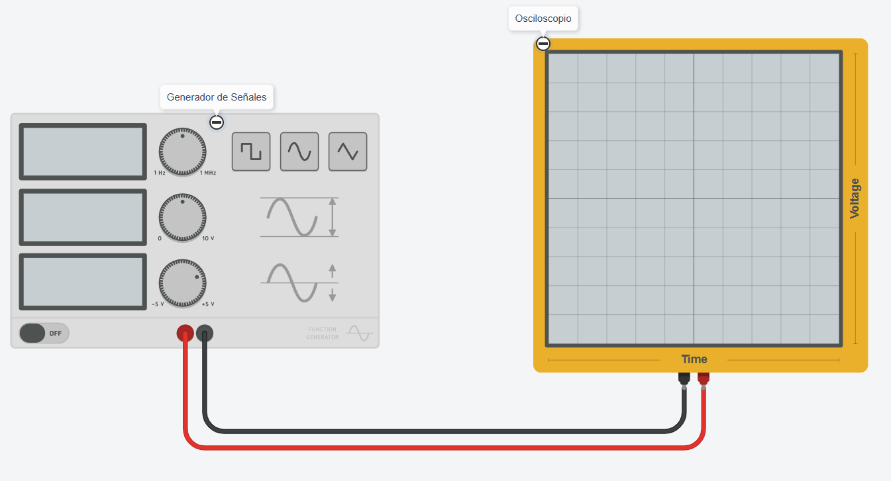
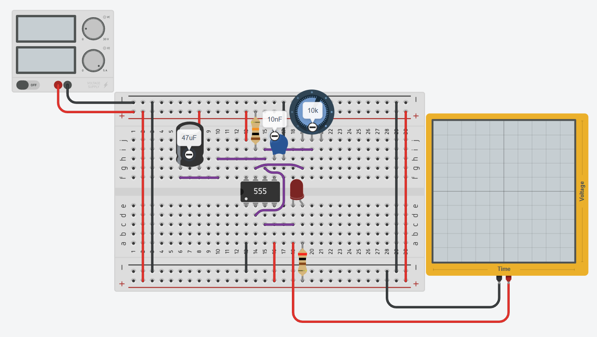

# Guía de Laboratorio 3: Uso del Generador de Señales, Osciloscopio y Montaje de un Circuito Astable con 555

### 1. Lista de Materiales
- Generador de señales
- Osciloscopio
- Multímetro
- *Protoboard
- Fuente de alimentación de 5V o 9V
- *Resistencias: 1kΩ, 4.7kΩ, 10kΩ, 47kΩ, 100kΩ
- *Condensador: 10nF, 100nF
- *Condesador electrolitico: 47uF
- *Circuito integrado 555
- *Cables de conexión

### 2. Preguntas de Prelaboratorio
1. ¿Qué es un generador de señales y cuál es su función en un laboratorio de electrónica?
2. ¿Cómo se mide la frecuencia y la amplitud de una señal en un osciloscopio?
3. ¿Cuál es la ecuación para calcular la frecuencia de oscilación de un circuito astable con 555?
4. ¿Cómo varían el tiempo en alto y el tiempo en bajo de un circuito astable con 555 en función de las resistencias?
5. ¿Qué aplicaciones prácticas tiene un circuito astable con 555?

### 3. Procedimiento
#### 3.1 Configuración del Generador de Señales
1. Encender el generador de señales y el osciloscopio.
2. Configurar el generador para emitir una señal senoidal.
3. Ajustar la señal con las siguientes combinaciones de frecuencia y amplitud:
   - **Caso 1**: 1kHz, 2Vpp
   - **Caso 2**: 5kHz, 3Vpp
   - **Caso 3**: 10kHz, 4Vpp
   - **Caso 4**: 50kHz, 5Vpp
   - **Caso 5**: 100kHz, 1Vpp
4. Observar la señal en el osciloscopio y verificar los valores ajustados.

#### 3.2 Montaje del Circuito Astable con 555
1. Conectar el circuito astable con 555 en el protoboard según el siguiente esquema:

Basarse en el siguiente diagrama de conexiones:

2. Utilizar las siguientes combinaciones de **R1** y **R2**:
   - **Caso 1**: R1 = 1kΩ, R2 = 10kΩ
   - **Caso 2**: R1 = 4.7kΩ, R2 = 47kΩ
   - **Caso 3**: R1 = 10kΩ, R2 = 100kΩ
   - **Caso 4**: R1 = 47kΩ, R2 = 100kΩ
   - **Caso 5**: R1 = 100kΩ, R2 = 100kΩ
3. Medir con el osciloscopio:
   - Frecuencia de oscilación
   - Tiempo en alto (T_high)
   - Tiempo en bajo (T_low)
4. Registrar los datos.

### 4. Tablas de Recolección de Datos
#### 4.1 Señales del Generador
| Caso | Frecuencia (Hz) | Amplitud (Vpp) | M. Osciloscopio Periodo | M. Osciloscopio Amplitud (V) | M. Osciloscopio Vrms |
|------|---------------|---------------|------------------------|------------------------|------------------------|
| 1    | 1kHz         | 2Vpp          |                        | 
| 2    | 5kHz         | 3Vpp          |                        |
| 3    | 10kHz        | 4Vpp          |                        |
| 4    | 50kHz        | 5Vpp          |                        |
| 5    | 100kHz       | 1Vpp          |                        |

#### 4.2 Circuito Astable con 555
| Caso | R1 (Ω) | R2 (Ω) | Frecuencia (Hz) medida | T_high (ms) | T_low (ms) |
|------|--------|--------|----------------------|-------------|------------|
| 1    | 1kΩ    | 10kΩ   |                      |             |            |
| 2    | 4.7kΩ  | 47kΩ   |                      |             |            |
| 3    | 10kΩ   | 100kΩ  |                      |             |            |
| 4    | 47kΩ   | 100kΩ  |                      |             |            |
| 5    | 100kΩ  | 100kΩ  |                      |             |            |

### 5. Preguntas de Análisis de Laboratorio
1. ¿Los valores medidos en el osciloscopio coinciden con los valores configurados en el generador de señales? Explica posibles diferencias.
2. ¿Cómo afecta la variación de la resistencia en el circuito astable con 555 a la frecuencia de oscilación?
3. ¿Cuál es la relación entre el tiempo en alto y el tiempo en bajo con respecto a los valores de las resistencias R1 y R2?
4. ¿Qué dificultades encontraste al realizar la medición con el osciloscopio?
5. ¿Qué aplicaciones prácticas podría tener el circuito astable con 555 en la industria o proyectos electrónicos?

---