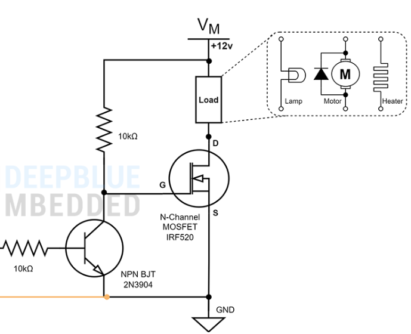

# Guía de Laboratorio 4: Uso de Transistores como Interruptor

---

## Lista de Materiales

- **Transistor BJT (NPN o PNP)** 2 unidades
  - **2N2222** (NPN)
  - **2N3904** (NPN)

- **Transistor MOSFET (N-channel o P-channel)** – 1 unidad
  - Ejemplo: **IRF520** (N-channel)
  
- **Relé de 5V o 12V** – 1 unidad  
  - (relé de 5V o 12V)  
  
- **Resistencias** – 1kΩ, 10kΩ, 100Ω  

- **Diodo Flyback** – 1 unidad  
  - Ejemplo: **1N4007**  
  
- **Motor DC de 5V o 12V** – 1 unidad 

---

## Preguntas de Prelaboratorio

1. ¿Qué es un transistor BJT y cómo se utiliza en conmutación?**
2. ¿Cuál es la diferencia clave entre un transistor BJT y un MOSFET?**
3. ¿Cómo afecta el tipo de transistor (NPN/PNE o N-channel/P-channel) al funcionamiento del relé?**
4. Explica cómo un transistor puede controlar la corriente a través de un relé.**
5. ¿Por qué es importante usar un diodo flyback cuando se activa un relé?**
6. ¿Cuál es la función del resistor de base (para BJT) o gate (para MOSFET) en este tipo de circuito?**
7. Describe las condiciones para que el transistor BJT o MOSFET se comporte como interruptor.**
8. ¿Qué ventajas tiene usar un MOSFET en lugar de un BJT para controlar cargas inductivas, como un relé?**

---

## Procedimiento

### 1. Circuito con Transistor BJT (NPN) como Interruptor

1. Conectar la base del transistor NPN a través de una resistencia de 1kΩ al pin de control (puede ser un interruptor o una señal de 5V).
2. Conectar el colector del transistor al relé, asegurándose de que el emisor esté conectado a tierra.
3. En el otro lado del relé, conectar la carga (motor o lámpara).
4. Conectar un diodo flyback en paralelo con el relé para proteger el transistor de las altas tensiones generadas por la inductancia del relé.
5. Aplicar un voltaje de 5V o 12V según las especificaciones del relé y la carga.

**Diagrama de BJT como Interruptor:**  
- [Ver video y diagrama de BJT Interruptor](https://www.youtube.com/watch?v=gI-wHhH41_8)

---

### 2. Circuito con Transistor MOSFET (N-channel) como Interruptor

Realizar el montaje en protoboard del circuito en base al siguiente diagrama:

**Diagrama de MOSFET como Interruptor:**  
- [Mas información sobre circuito con MOSFET como interruptor](https://deepbluembedded.com/arduino-mosfet-switch-n-channel-irf520-pwm-tutorial/)

---

