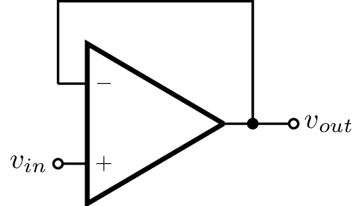
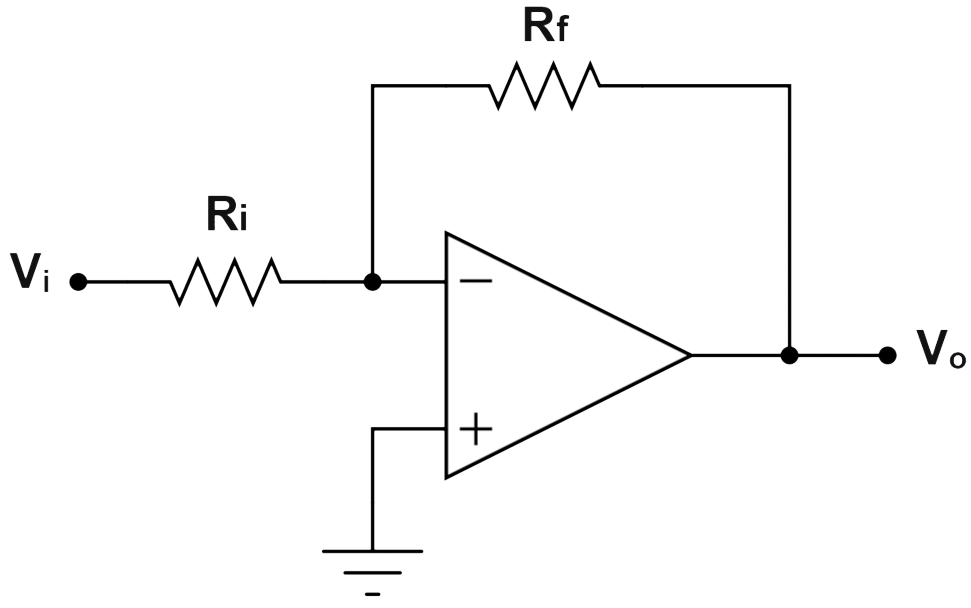
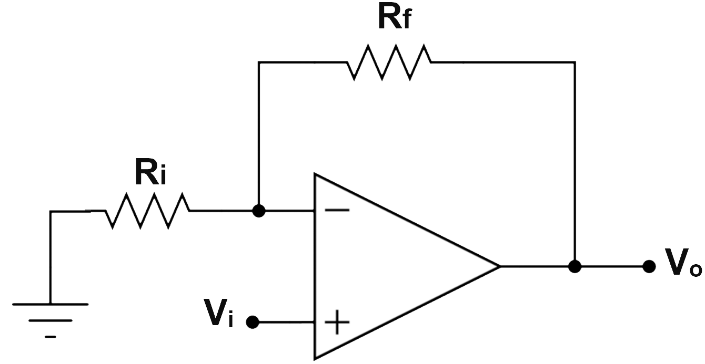

# Guía de Laboratorio 5: Uso del Amplificador Operacional

## Introducción
El amplificador operacional (OpAmp) es un componente fundamental en la electrónica analógica. Su versatilidad permite utilizarlo en diversas configuraciones como amplificadores, filtros, comparadores y sumadores.

## Objetivos
- Comprender el funcionamiento básico de un amplificador operacional.
- Implementar y analizar circuitos con OpAmps en configuraciones fundamentales.
- Medir y verificar el comportamiento de los circuitos usando instrumental de laboratorio.
- Implementar un comparador con OpAmp para activar una luminaria.

## Prelaboratorio
Antes de realizar la práctica, responde las siguientes preguntas:
1. ¿Cómo funciona un divisor de voltaje y cuál es su ecuación fundamental?
2. ¿Qué es una LDR y cómo varía su resistencia con la luz?
3. ¿Cómo se comporta un amplificador operacional en modo comparador?
4. ¿Cuál es la ecuación de ganancia para un amplificador inversor y un amplificador no inversor?
5. ¿Cómo se puede utilizar un OpAmp para activar una carga como una lámpara?
6. Relizar el calculo de las resistencias para un amplificador inversor con ganancia de 100 y 250.
7. Revisar video de conexión de fuente dual [Conexión fuente dual](https://www.youtube.com/watch?v=W6mSkdIRtEA)

## Materiales
- Amplificador operacional (Ejemplo: LM741)
- Resistencias diferentes valores, incluidas las calculadas en el prelaboratorio
- LDR (Resistencia dependiente de la luz)
- Potenciometro de 10 k$\Omega$
- Relé
- Transistor BJT
- Protoboard y cables

## Fundamentos Teóricos
Un amplificador operacional es un dispositivo con alta ganancia de voltaje, idealmente con impedancia de entrada infinita y impedancia de salida cero. Sus configuraciones básicas incluyen:

### 1. **Seguidor de Voltaje (Buffer)**
Permite aislar etapas de un circuito sin alterar la señal de entrada.

### 2. **Amplificador Inversor**
Ajusta la ganancia mediante dos resistencias y cambia la fase de la señal.

**Fórmula de ganancia:**
\[ A_v = -\frac{R_f}{R_{in}} \]

### 3. **Amplificador No Inversor**
Amplifica la señal sin invertir la fase.

**Fórmula de ganancia:**
\[ A_v = 1 + \frac{R_f}{R_1} \]

### 4. **Comparador con OpAmp**
Un comparador de voltaje compara dos señales y genera una salida alta o baja dependiendo de la relación entre ellas.

## Procedimiento Experimental

### **Experimento 1: Seguidor de Voltaje**
1. Conectar el OpAmp en configuración de seguidor.
2. Mediante el generador de señales, aplicar una forma de onda seno con valor de 100 mV y diferentes frecuencias, medir la salida.
3. Verificar que la salida es igual a la entrada.

### **Experimento 2: Amplificador No Inversor**
1. Armar el circuito con ganancia de 100 y 250, aplicar una señal de entrada con forma seno de 10 mV.
2. Medir la salida y verificar la relación con la entrada.

### **Experimento 3: Comparador para activar una luminaria**
1. Construir un divisor de voltaje con una LDR y una resistencia fija.
2. Conectar la salida del divisor a la entrada inversora del OpAmp.
3. Aplicar un voltaje de referencia en la entrada no inversora.
4. Conectar la salida del OpAmp a transistor para activar un relé ([Circuito guía](https://www.matni.co/Arabic/Elec-Info/LIGHT%20SWITCH/sensor2.htm))
5. Exponer la LDR a diferentes niveles de luz y observar el comportamiento del sistema.

## Preguntas de Análisis
1. ¿Cómo afecta la resistencia de la LDR en el punto de conmutación del comparador?
2. ¿Cómo influye el valor de la resistencia fija en el divisor de voltaje?
3. ¿Cómo se puede mejorar la estabilidad del comparador para evitar oscilaciones en la salida?
4. ¿Qué otros sensores podrían usarse en lugar de una LDR para activar la luminaria?

## Recursos Adicionales
- [Wikipedia - Amplificador Operacional](https://es.wikipedia.org/wiki/Amplificador_operacional)
- [All About Circuits - Operational Amplifier Basics](https://www.allaboutcircuits.com/textbook/semiconductors/chpt-8/introduction-operational-amplifiers/)
- [Khan Academy - Operational Amplifiers](https://www.khanacademy.org/science/electrical-engineering/ee-amplifiers/ee-opamp)