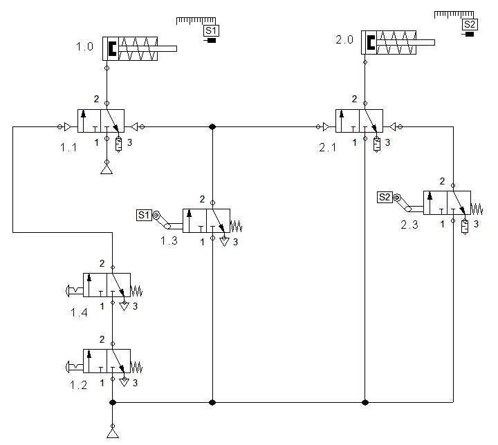

# Control neumático de cilindros de simple efecto

## Objetivo

- Construir un circuito neumático de mando para el control combinacional de cilindros de simple efecto, utilizando válvulas 3/2.
- Diseñar e implementar un circuito neumático de mando para el control combinacional de cilindros de simple efecto, empleando válvulas 3/2 y válvulas lógicas tipo OR y AND.

## Marco teórico

Los componentes neumáticos son dispositivos que utilizan aire comprimido como fuente de energía para su funcionamiento. Entre ellos se encuentran cilindros y pistones que, al recibir aire comprimido por una de sus entradas, generan un desplazamiento mecánico.

Las válvulas son elementos de control que dirigen el flujo de aire comprimido en un sistema neumático. Las válvulas todo/nada, por ejemplo, actúan como interruptores binarios que permiten o bloquean el paso del aire. Algunas conectan una línea de presión al suministro de aire comprimido; otras permiten liberar esa presión hacia la atmósfera o cambiar la dirección del flujo.

### Cilindros de simple efecto

En los cilindros de simple efecto, el aire comprimido se aplica solo en un lado del pistón; el otro lado permanece abierto a la atmósfera. Estos cilindros realizan trabajo únicamente en una dirección, y su retorno se logra mediante un resorte interno o una fuerza externa.

La fuerza del resorte regresa al pistón a su posición inicial con una velocidad razonablemente alta, siempre que no exista carga. Este retorno está limitado por las propiedades del resorte.

Estos cilindros requieren una sola conexión neumática y un puerto de descarga, el cual debe permanecer libre de obstrucciones para garantizar un correcto retorno del pistón. Es común colocar un filtro en el puerto de descarga.

El pistón opera mediante el suministro de aire comprimido a su único puerto de entrada. Al eliminar esta fuente, el resorte interno lo devuelve a su posición original. La **Figura 1** muestra el diagrama representativo de un cilindro de simple efecto. 

  

**Figura 1.** Cilindro de simple efecto.

Una válvula de 3 vías y de 2 posiciones **3/2**, normalmente cerrada y accionada manualmente, se representa como en la **Figura 2**:

  

**Figura 2.** Válvula 3/2 accionada manualmente.

- **1**: entrada de aire comprimido.  
- **2**: salida hacia el sistema.  
- **3**: escape hacia la atmósfera.

**Funcionamiento:**

- En su estado normal (no accionada), la entrada **1** está bloqueada y la salida **2** se conecta al escape **3**.
- Al accionar la válvula, **1** se conecta con **2**, y el escape queda bloqueado.

El símbolo muestra ambas condiciones: la posición izquierda representa el estado accionado, y el derecho, el estado normal.

### Función lógica "AND" con componentes neumáticos

La **Figura 3** muestra cómo implementar la función lógica **AND** usando válvulas 3/2 normalmente cerradas de accionamiento neumático.

  
**Figura 3.** Función lógica AND con válvulas.

La salida de aire a través de **A** se obtiene solo si ambas entradas de señal (**Y** y **Y2**) están presentes. Si alguna falta, no habrá salida. También existen válvulas comerciales que realizan esta función y se conocen como **válvulas de simultaneidad**.

### Función lógica "OR" con componentes neumáticos

La **Figura 4** muestra cómo implementar la función lógica **OR** con válvulas 3/2 normalmente cerradas.

  
**Figura 4.** Función lógica OR con válvulas.

En este caso, existirá presión en la salida **A** si hay presión en **Y1** o en **Y2**. También existen versiones comerciales llamadas **válvulas selectoras**.

## Actividad previa

a) Investigar el funcionamiento de las válvulas lógicas **AND (simultaneidad)** y **OR (selectora)**. Redactar un párrafo que describa su operación.

b) Usando un simulador como **FluidSim**, construir el siguiente circuito neumático y comprobar las observaciones anteriores sobre las funciones lógicas **AND** y **OR**.

## Preguntas de reflexión

a) Con base en el circuito anterior, ¿qué modificaciones serían necesarias para que el cilindro regrese de forma automática?

b) ¿Qué aplicación industrial podría tener este circuito? Agregar una imagen o figura del proceso o máquina correspondiente.

## Desarrollo experimental

### Materiales

Los materiales a utilizar corresponden a los mostrados en la figura del inciso a) de las actividades.

## Actividades

a) Montar el circuito mostrado en la siguiente figura:

1. Activar los elementos de mando y observar el comportamiento de los cilindros.  
   **Pregunta:** ¿Cuál es el diagrama espacio-fase que representa el comportamiento observado?

2. Sustituir el pulsador 1.2 por uno con enclavamiento y repetir el experimento.  
   **Pregunta:** ¿Qué cambios se observan y cuál es la causa de dichos cambios?

3. Restaurar el pulsador 1.1 y cambiar la válvula 3/2 1.1 por una de regreso por resorte. Activar los pulsadores y observar.  
   **Pregunta:** ¿Qué variaciones se presentan en el comportamiento de los cilindros? Explicar brevemente el funcionamiento de una válvula 3/2 con y sin resorte.

<!--
## Actividades complementarias

Diseñar un circuito de control neumático de mando para ejecutar una secuencia basada en el diagrama espacio-fase de dos cilindros de simple efecto. La secuencia iniciará según la siguiente operación:
-->
